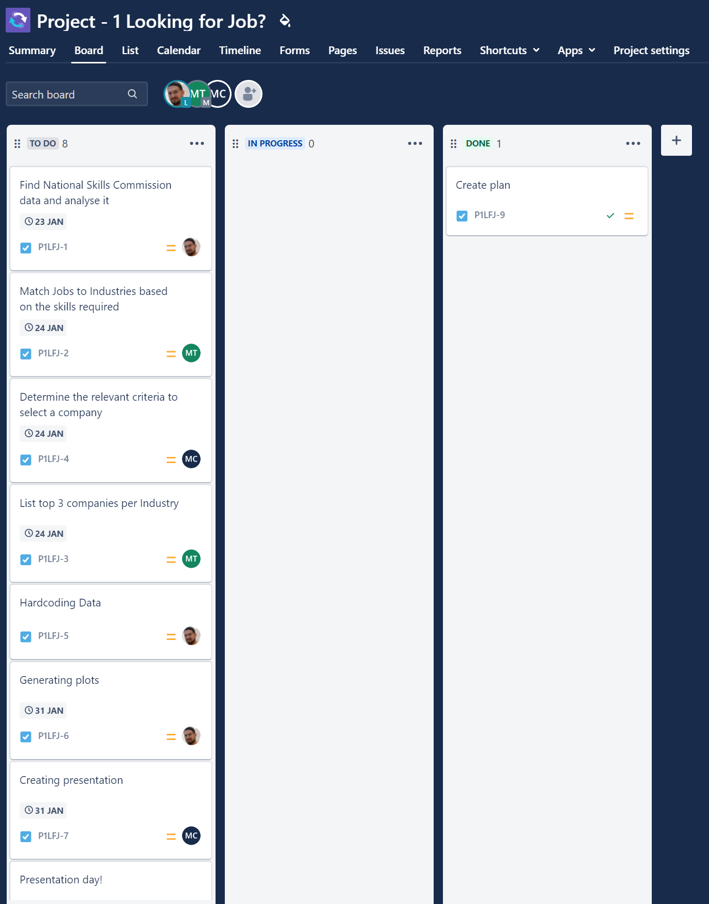

# Project-1---Looking-for-work-

# Project 1 - Looking for work?

To help people finding a potential employer based on their situation, data From the National Skills Commission of the Australian Government (https://www.nationalskillscommission.gov.au/topics/skills-priority-list), Determine the required Occupation titles, which have the skills that are in shortage and their National Future Demand Rating. This can be then matched with the current job offerings (Look for any type of API from Linkedin, Seek, Indeed, Glassdoor or alike). Then on a separate analysis check what the best companies are in terms of size, revenue, market share or any other relevant metric. Then match the 2 analyses to provide the best possible list of companies to apply for, given a set of competencies and aspirations a person would have in terms of what fulfils them in a company (Big, mid, small size company, company reputation, Job Security, etc)

## Information from National Skills Commission [1]

Source: National Skills Commission, Skills Priority List, 2022

The 2022 SPL is based on the Australian and New Zealand Standard Classification of Occupations (ANZSCO), 2021 Australian Update
This document records findings from the Skills Priority List 2022. Please note that this document is intended to provide a summary of some the information and evidence considered for each individual occupation and should be read with the Skills Priority List Methodology for context. The methodology is available on the NSC website at https://www.nationalskillscommission.gov.au/skills-priority-list. 

SPL Overview
The National Skills Commission has responsibility for providing trusted and independent intelligence on Australia’s labour market. A key deliverable for the NSC in this role is the Skills Priority List.
The SPL provides a detailed view of occupations in shortage, nationally, and by state and territory, as well as the future demand for occupations in Australia. The list is a single source of intelligence on occupations in shortage. While the SPL helps inform advice on the targeting of policy initiatives, it is important to note that it is not the only input into any such advice. 
The list and occupation assessments are determined through extensive statistical analysis of the labour market, employer surveys, and broad stakeholder engagement with peak bodies, industry groups, professional associations, unions, regional representative bodies and major employers in the Australian labour market, combined with consultations with federal, state and territory governments.
The SPL is reviewed and updated annually. Additional reports based on the SPL will be published on the NSC website.

Labour Market Rating definitions
Taking account of all available information, a labour market rating is determined for each occupation.
Ratings are provided nationally, and for each state and territory, where sufficient evidence is available. Where there is evidence suggesting variation between metropolitan and regional locations this is reflected in the rating. The term metropolitan area refers to state and territory capital cities and regional refers to the rest of the state or territory.
An occupation may be assessed as being in shortage even though not all specialisations are in shortage. Similarly, a rating of national shortage does not mean that employers in every geographical location have difficulty recruiting. While an occupation can be considered in shortage, it is still possible that job seekers can face significant competition for positions (due to the level of experience or specialisations required). Similarly, employers can still have difficulty recruiting for occupations that are not in shortage.
The SPL provides the following ratings of the current labour market for occupations where sufficient data are available to make an assessment.

Shortage (S)
Shortages exist when employers are unable to fill or have considerable difficulty filling vacancies for an occupation, or significant specialised skill needs within that occupation, at current levels of remuneration and conditions of employment, and in reasonably accessible locations.
In some instances, shortages may be apparent in particular specialisations within the occupation, but otherwise shortages are not apparent. In these instances, provided there is sufficient evidence, the occupation will still be considered in shortage.

Metropolitan Shortage (M)
Shortages, (as defined above) are restricted to metropolitan areas.

Regional Shortage (R)
Shortages (as defined above) are restricted to regional areas.

No Shortage (NS)
Research has not identified any significant difficulty filling vacancies.
For some occupations, a lack of evidence overall will, by default, result in an occupation being rated as ‘No Shortage’. 

## Submission

1. Submitted and available in GitHub under https://github.com/lcardsvr/Project-1---Looking-for-work-

## References

1. Skills Priority List - National Skills Commission - Australian Government - Skills Priority List 2022.xlsx - https://www.nationalskillscommission.gov.au/topics/skills-priority-list

2. 1220.0 - ANZSCO -- Australian and New Zealand Standard Classification of Occupations, 2013, Version 1.3  - https://www.abs.gov.au/AUSSTATS/abs@.nsf/DetailsPage/1220.02013,%20Version%201.3?OpenDocument
    Data cubes used - ANZSCO Version 1.3 - Structure, 12200 ANZSCO Version 1.3 Index of principal titles, alternative titles and specialisations 

3. Glassdoor Job Reviews - A large dataset of job reviews with textual features and numerical targets https://www.kaggle.com/datasets/davidgauthier/glassdoor-job-reviews (glassdoor_reviews.csv)

4. Salaries and Job Postings by Company in Australia - Uncovering Industry Trends and Analyzing Companies’ Salary Structures - https://www.kaggle.com/datasets/thedevastator/analyzing-the-salaries-and-job-postings-in-austr (seek_australia.csv)

5. Salaries taken from https://www.glassdoor.com.au/Salaries/

6. Industries and top companies: https://blog.iseekplant.com.au/blog/australias-top-100-construction-firms
    https://www.subsea.org/list-of-oil-and-gas-companies-in-australia/
    https://www.outlookindia.com/outlook-spotlight/top-software-development-companies-in-australia-2023-news-239010
    https://www.statista.com/statistics/1181152/australia-top-food-and-drink-businesses-by-revenue/
    https://clutch.co/au/it-services/cybersecurity
    https://blog.facilitybot.co/blog/top-security-companies-au/

7. Internet Vacancy Index - https://www.jobsandskills.gov.au/work/internet-vacancy-index - 
IVI_DATA Detailed Occupation - March 2006 onwards
